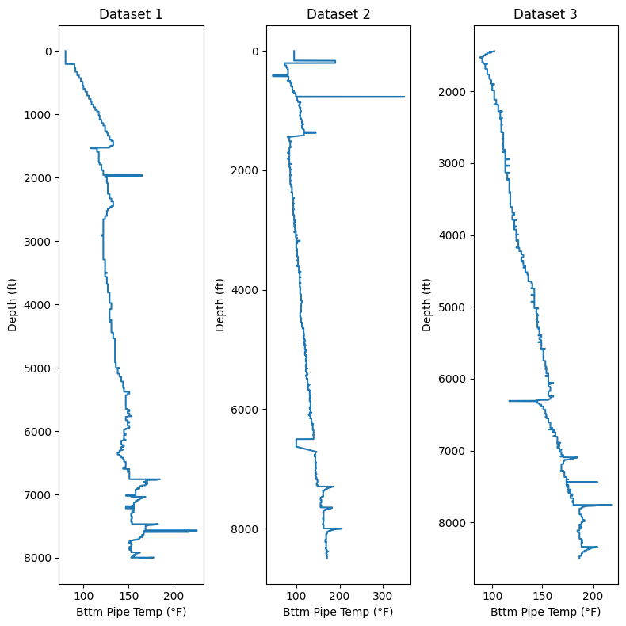
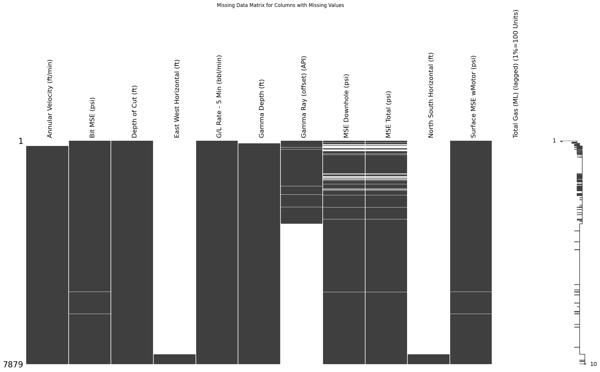
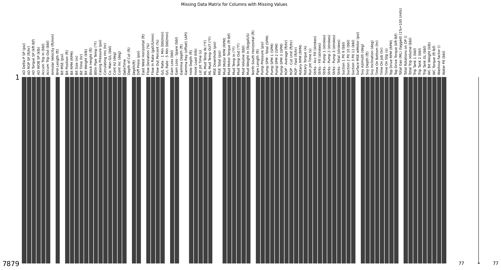
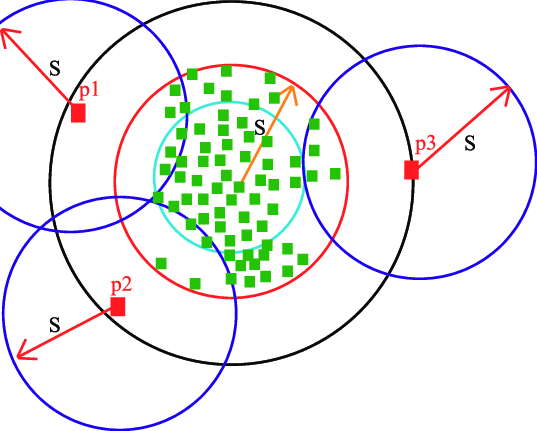
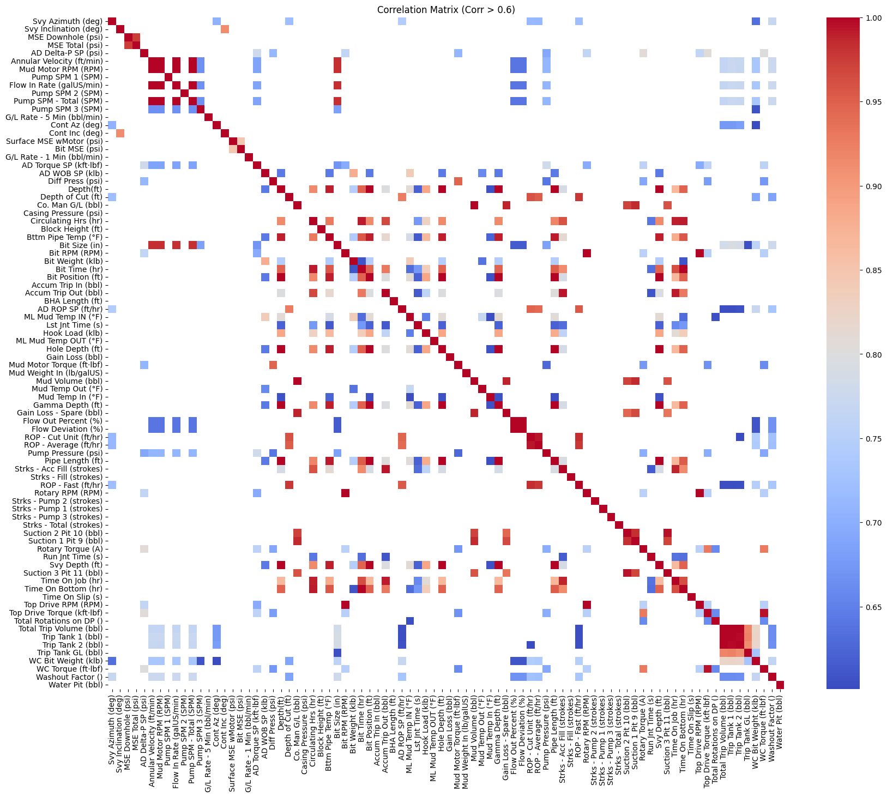
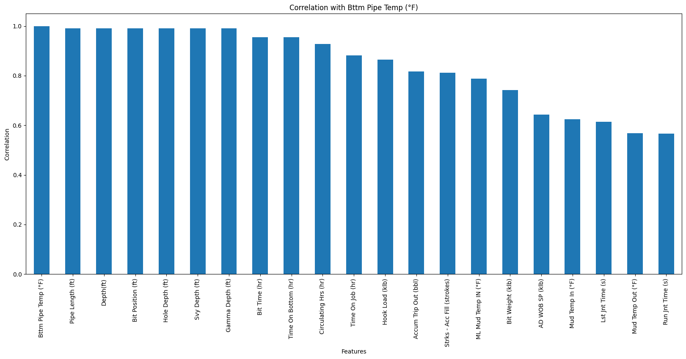
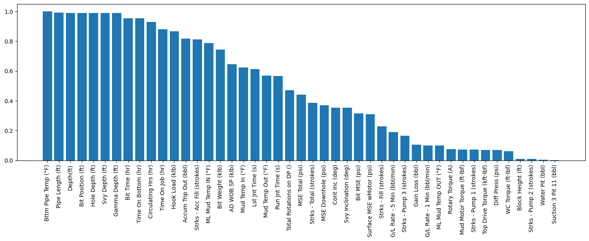
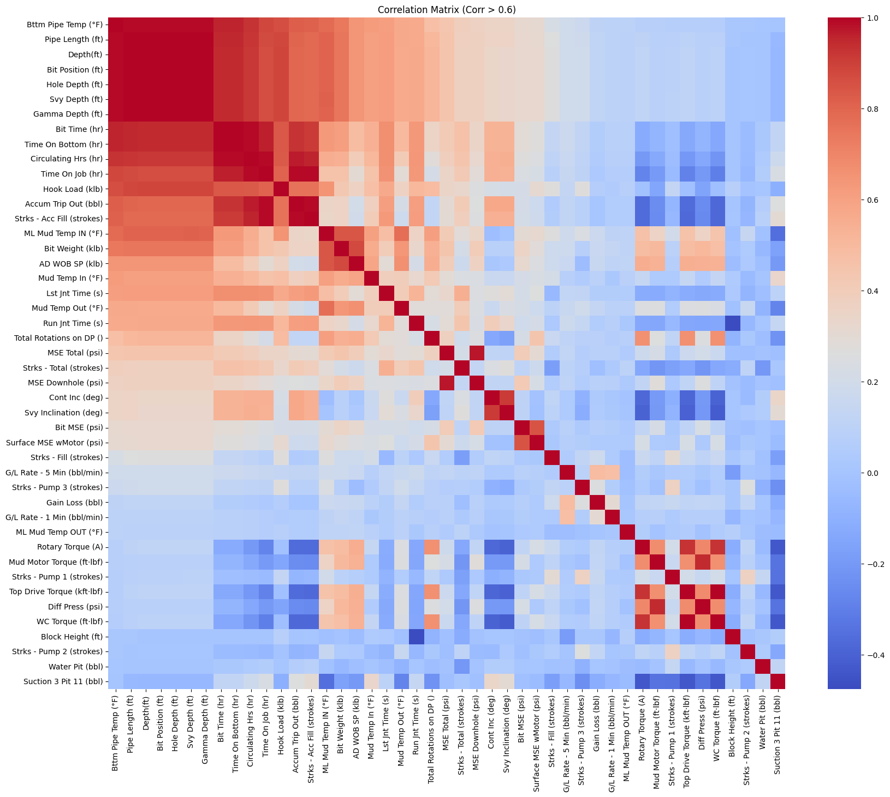

# BHCT Prediction - SPE ML Challenge 2025 by Fervo

## 1. Introduction

- **Problem Statement**
- **Objectives and Goals**
- **Importance and Real-World Applications**

## 2. Data Understanding

- **2.1: Data Description** (features, target variable)
Summary Statistics for df1:

|       |   Bttm Pipe Temp (°F) |   Pipe Length (ft) |   Depth(ft) |   Bit Position (ft) |   Hole Depth (ft) |   Svy Depth (ft) |   Gamma Depth (ft) |   Bit Time (hr) |   Time On Bottom (hr) |   Circulating Hrs (hr) |
|:------|----------------------:|-------------------:|------------:|--------------------:|------------------:|-----------------:|-------------------:|----------------:|----------------------:|-----------------------:|
| count |              7800     |            7800    |     7800    |             7800    |           7800    |          7800    |            7800    |       7800      |             7800      |              7800      |
| mean  |               133.12  |            2945.51 |     4070.37 |             4071.2  |           4071.2  |          3958.91 |            4010.65 |         23.0861 |               23.0861 |                37.4025 |
| std   |                18.364 |            2121.89 |     2278    |             2278.07 |           2278.07 |          2279.12 |            2274.6  |         19.0616 |               19.0616 |                32.1327 |
| min   |                80     |               0    |        1    |                1    |              1    |             0    |             148    |          1.6    |                1.6    |                 0      |
| 25%   |               122     |             852    |     2099.75 |             2100.52 |           2100.52 |          2004.92 |            2042    |          9.7    |                9.7    |                18.3    |
| 50%   |               131     |            2838.4  |     4069.5  |             4070.34 |           4070.34 |          3987.39 |            4010.5  |         15.7    |               15.7    |                26.6    |
| 75%   |               147     |            4826.1  |     6049.25 |             6050.18 |           6050.18 |          5974.16 |            5991.25 |         30.325  |               30.325  |                44.6    |
| max   |               226     |            7758.7  |     8009    |             8010    |           8010    |          7876.05 |            7944    |         81      |               81      |               135.5    |

Summary Statistics for df2:
|       |   Bttm Pipe Temp (°F) |   Pipe Length (ft) |   Depth(ft) |   Bit Position (ft) |   Hole Depth (ft) |   Svy Depth (ft) |   Gamma Depth (ft) |   Bit Time (hr) |   Time On Bottom (hr) |   Circulating Hrs (hr) |
|:------|----------------------:|-------------------:|------------:|--------------------:|------------------:|-----------------:|-------------------:|----------------:|----------------------:|-----------------------:|
| count |             8176      |            8176    |     8176    |             8176    |           8176    |          8176    |            8176    |       8176      |             8176      |              8176      |
| mean  |              118.653  |            3247.34 |     4289.4  |             4290.34 |           4290.34 |          4219.17 |            4224.35 |         30.3984 |               30.3984 |                88.1618 |
| std   |               28.1337 |            2242.29 |     2424.63 |             2424.69 |           2424.69 |          2423.19 |            2426.06 |         25.9454 |               25.9454 |                50.6529 |
| min   |               46      |               0    |        1    |                1.03 |              1.03 |           -63.97 |             -60.84 |          0      |                0      |                 6.8    |
| 25%   |               97      |            1042.4  |     2204.75 |             2205.73 |           2205.73 |          2133.34 |            2135.89 |         10.1    |               10.1    |                24.1    |
| 50%   |              111      |            3124.2  |     4277.5  |             4278.49 |           4278.49 |          4206.32 |            4208.88 |         20.9    |               20.9    |               111.2    |
| 75%   |              138      |            5205.3  |     6348.25 |             6349.23 |           6349.23 |          6276.96 |            6279.52 |         44.9    |               44.9    |               125.5    |
| max   |              349      |            7476.2  |     8499    |             8500    |           8500    |          8427.95 |            8424.04 |         97.1    |               97.1    |               202      |

Summary Statistics for df3:
|       |   Bttm Pipe Temp (°F) |   Pipe Length (ft) |   Depth(ft) |   Bit Position (ft) |   Hole Depth (ft) |   Svy Depth (ft) |   Gamma Depth (ft) |   Bit Time (hr) |   Time On Bottom (hr) |   Circulating Hrs (hr) |
|:------|----------------------:|-------------------:|------------:|--------------------:|------------------:|-----------------:|-------------------:|----------------:|----------------------:|-----------------------:|
| count |             6855      |            6855    |     6855    |             6855    |           6855    |          6855    |            6855    |       6855      |             6855      |              6855      |
| mean  |              140.955  |            3806.82 |     4981.29 |             4982.26 |           4982.26 |          4916    |            4919.62 |         29.9018 |               29.9018 |                77.661  |
| std   |               28.8076 |            2056.81 |     2040.39 |             2040.4  |           2040.4  |          2037.93 |            2038.54 |         20.6314 |               20.6314 |                32.3189 |
| min   |               88      |             284.3  |     1441    |             1441.87 |           1441.87 |          1377.65 |            1380.61 |          5.5    |                5.5    |                42.7    |
| 25%   |              117      |            1988.3  |     3212.5  |             3213.46 |           3213.46 |          3148.93 |            3151.89 |         12.7    |               12.7    |                52.5    |
| 50%   |              142      |            3785.6  |     4965    |             4965.99 |           4965.99 |          4901.81 |            4904.77 |         22.9    |               22.9    |                64.6    |
| 75%   |              163      |            5489.3  |     6757.5  |             6758.48 |           6758.48 |          6686.28 |            6689.41 |         43.3    |               43.3    |               104.4    |
| max   |              219      |            7476.9  |     8499    |             8499.99 |           8499.99 |          8425.95 |            8429.34 |         82.8    |               82.8    |               159.6    |

- **2.3: Data Exploration** (visualizations, summary statistics)
The bottomhole temprature profile is depicted below, we can see that the BCHT follows almost a linear behaviour with some outliers. 

- **2.4: Missing Data Analysis:**
  I used the missingno package to study the missing data (coded as -999.25) and found out some of the columns are up to 100% missing. Below is a summary of the column and missing percentage and a visualization to show a comparative view.

| Column                                 | Missing Percentage |
| -------------------------------------- | ------------------ |
| Annular Velocity (ft/min)              | 2.32%              |
| Bit MSE (psi)                          | 0.23%              |
| Depth of Cut (ft)                      | 0.01%              |
| East West Horizontal (ft)              | 95.56%             |
| G/L Rate - 5 Min (bbl/min)             | 0.03%              |
| Gamma Depth (ft)                       | 1.14%              |
| Gamma Ray (offset) (API)               | 63.24%             |
| MSE Downhole (psi)                     | 5.98%              |
| MSE Total (psi)                        | 5.98%              |
| North South Horizontal (ft)            | 95.56%             |
| Surface MSE wMotor (psi)               | 0.23%              |
| Total Gas (ML) (lagged) (1%=100 Units) | 100.00%            |

I decided to discard columns of missing data more than 20%, nothing special about the percentage, this is a pure personal preference. The imputation approach of the remaining colums is by using the KNN imputer in the sklearn package. This approach involves learning from data and more efficient than mean or median imputation. Below how the data looks like after using backfill operation. That means following columns will be dropped.

| Column                                 | Missing Percentage |
| -------------------------------------- | ------------------ |
| East West Horizontal (ft)              | 95.56%             |
| Gamma Ray (offset) (API)               | 63.24%             |
| North South Horizontal (ft)            | 95.56%             |
| Total Gas (ML) (lagged) (1%=100 Units) | 100.00%            |

- **2.5: Outliers Analysis:**

Local Outlier Factor (LOF) method was used analyze the outliers. I decided to remove the top 1% of the outliers scores. Here is the before and after values for the outlier removal from the 3 datasets.

| DataFrame | Original Length| New Length | Removed Points |
|-----------|----------------|------------|----------------|
| df1       | 7879           | 7800       | 79             |
| df2       | 8259           | 8176       | 83             |
| df3       | 6925           | 6855       | 70             |

## 3. Data Preprocessing
- **Correlation Matrix**
Since we have large number of columns, I kept only correlations above 0.5, checking the correlation matirx below.

below is correlations that are above 0.5

  I also looked at all the positive correlations in the chart below.

- **Feature Selection and Engineering**
Some of these columns are prone to high covariance, this can be noticed from looking at the correlations values and can also be concluded from field experience, below is an example.

  | Column                  | Correlation |
  |-------------------------|-------------|
  | Bttm Pipe Temp (°F)     | 1.000000    |
  | Pipe Length (ft)        | 0.991367    |
  | Depth(ft)               | 0.990280    |
  | Bit Position (ft)       | 0.990280    |
  | Hole Depth (ft)         | 0.990280    |
  | Svy Depth (ft)          | 0.990214    |
  | Gamma Depth (ft)        | 0.990206    |
  | Bit Time (hr)           | 0.954932    |
  | Time On Bottom (hr)     | 0.954932    |
  | Circulating Hrs (hr)    | 0.928182    |

  For instance, pipe length, depth, hole depth are all highly correlated since they are measuring or representing a similar value in a way or another, for this reason I decided to study all the variables. Here is the final list of my selected variables for the base model (provided data dictionary was utilized to understand the data variables and I looked at the positive correlations only).

  
  | Column Name                  |
  |------------------------------|
  | Depth(ft)                    |
  | Bit Time (hr)                |
  | Time On Bottom (hr)          |
  | Hook Load (klb)              |
  | Strks - Acc Fill (strokes)   |
  | ML Mud Temp IN (°F)          |
  | Bit Weight (klb)             |
  | Mud Temp In (°F)             |
  | Lst Jnt Time (s)             |
  | Mud Temp Out (°F)            |
  | Run Jnt Time (s)             |
  | Total Rotations on DP ()     |
  | MSE Total (psi)              |
  | Bit MSE (psi)                |
  | Gain Loss (bbl)              |
  | Rotary Torque (A)            |
  | Diff Press (psi)             |

  - **Colinearity Analysis:** Looking at the data glosaary and from domain experience we can expect some multi-coolinearity between some of the variables easpecially the ones that can be inferred from others or measure a variation of the same quantity. I eliminated the negative correlations and recreated the correation matrix to invetigate some of the variables.

  
it can be easily seen that we have a very highly correlated areas in the correlation matrix, let's breakdown these observations:

  - **Depth related measurements**: Pipe Lenght, Bit Depth, Bit Position, Hole Depth, Survey Depth, Gamma Depth.
  - **Time related measurements**: This can be spotted at the second red area on the correlation matrix, starting from Bit Time all the way to Strks, Bit time, time on the job, Circulating Hours, Time on Bottom,Time on Job, Hook Load can also be a proxy to time as it increases with time. 

- **Data Transformation** (scaling, encoding, normalization): I used standard scaler to scale the training data, the scaling happened after the split to preven any data leakage. 

- **Splitting Data** (train-test-validation split): Data was splitted into 80/20 ratio and the subset columns were applied to the raw datasets.

## 4. Model Selection and Training
- **Overview of Algorithms Considered**
I tried to stick to regression and decision based algorithms since this a a problem of regression nature. 
- **Models**

  | Model                   | R² Value |
  |-------------------------|----------|
  | Ridge Regression        | 0.904    |
  | Elastic Net Regression  | 0.904  |
  | Lasso Regression        | 0.904 |
- **Hyperparameter Tuning**: All parameters were left to default at this stage, since we are generating a base model.

- **Model Training Details**

## 5. Model Evaluation

- **Performance Metrics** (accuracy, precision, recall, F1-score, etc.)
- **Confusion Matrix, ROC Curve, and AUC**
- **Cross-Validation Results**
- **Error Analysis**

## 6. Results and Discussion

- **Key Findings from Model Evaluation**
- **Comparison of Different Models**
- **Insights from Feature Importance Analysis**
- **Challenges Encountered**

## 7. Deployment (if applicable)

- **Model Saving and Loading**
- **API Development** (Flask, FastAPI, etc.)
- **Integration with Web Applications or Cloud Services**

## 8. Conclusion and Future Work

- **Summary of Findings**
- **Limitations of the Current Approach**
- **Recommendations for Improvement**
- **Future Research Directions**

## 9. References

- **Cite Books, Research Papers, Datasets, and Other Sources**

## 10. Appendices (if needed)

- **Additional Charts, Code Snippets, or Experiment Details**
